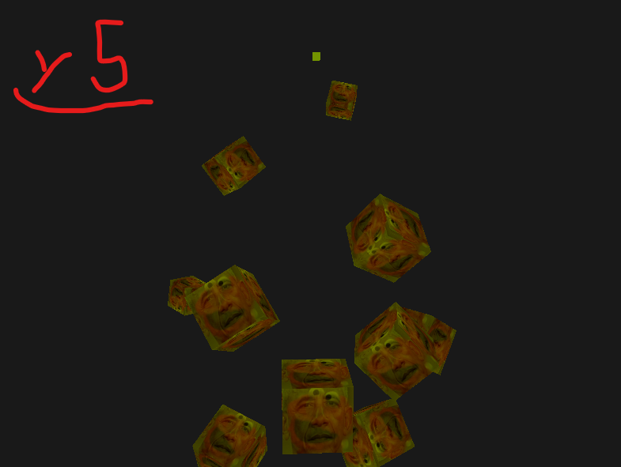

# y5 - OpenGL?

why 5?

## Features

- **General stuff**
    - [x] Model loader (`.obj`)
    - [x] Shader loader (`.glsl`)
    - [x] GUI (imgui)
    - [ ] Planets thingy
- **Calc stuff**
    - [x] 3D Camera
    - [x] 3D Camera Movement
    - [ ] Hitboxes
    - [ ] Simple Rigid body Physics
    - [ ] Simple Mass Physics
- **Shader stuff**
    - [x] Basic Lighting (phong)
    - [x] Textures
    - [x] Materials
    - [ ] Normal maps
    - [ ] Specular maps

## y5 Showcase

**Latest Development Screenshot**

  
   
  <em>✨ y5 - 202624 ✨</em>

**First Development Screenshot**

  
   
  <em>✨ y5 - 202509 ✨</em>

